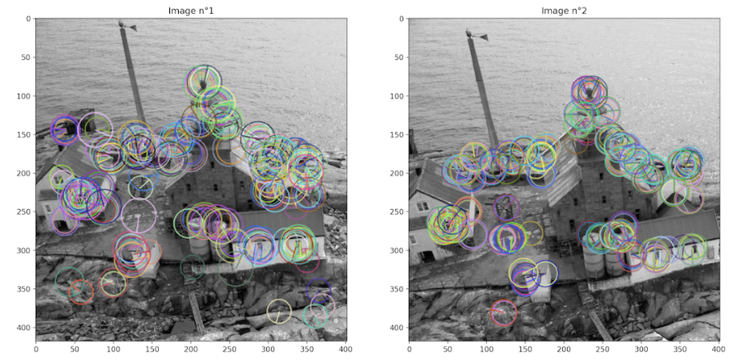
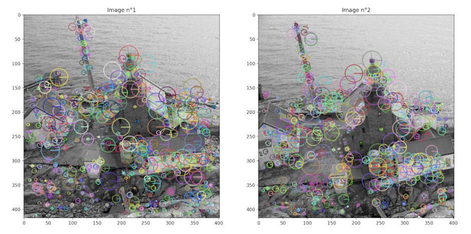
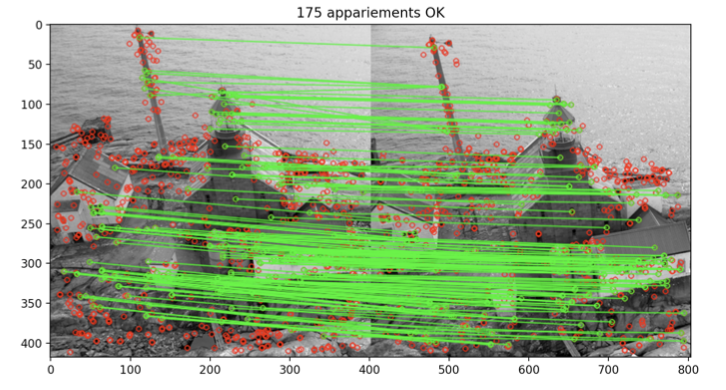
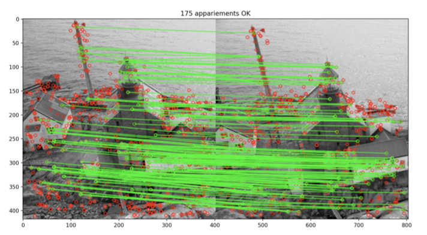
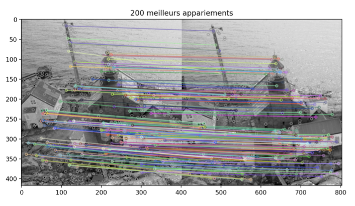
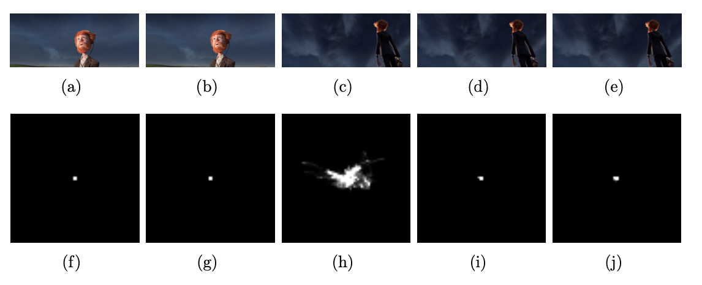
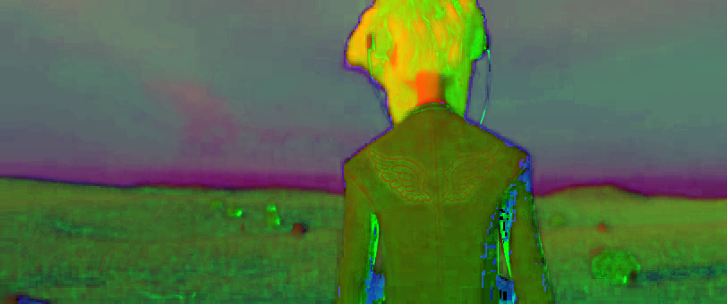
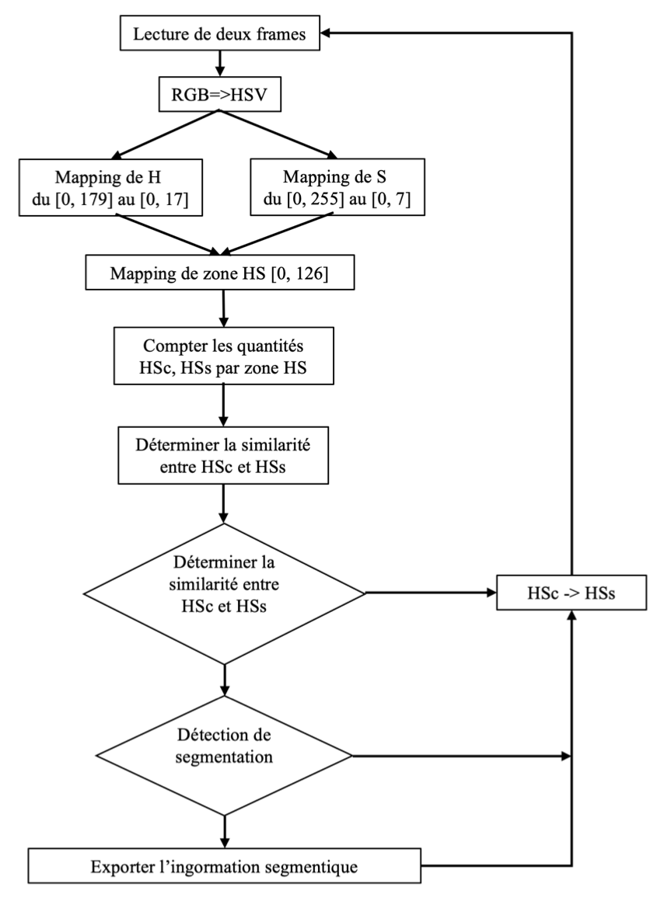

Image Processing

*Author : Yan CHEN*

This is a course (ROB317) project of ENSTA Paris robotics, including 2 parts.

In this project, the paper[1] has been reproduced.

## 1. Detection and Matching of feature point

* ORB

  

  
nfeatures = 250, scalarFactor = 1.1, nlevels = 3

* KAZE

  

Threshold = 0.001, nOctaves = 4, nOctave- Layers= 4, diffusivity = 2

* FLANN

FLANN & KAZE

* RatioTest

  

RatioTest & KAZE

* CrossCheck

  

CrossCheck & KAZE

## 2. Video trimming and indexing

* Colour histogram

* Optical flow and velocity histogram

* Key frame detection
  * Base on optical flow
  
    

  
  
First row: the original frames of a consequence. Second row: the 2d histograms corresponding to the joint probability of the components (Vx, Vy) belonging to original frames of a consequence

  
  * Base on frame-by-frame difference
  
    

  
  * Based on the HSV colour model[1]
  
    

  
  
Key frame detection diagram based on HSV Color Model

## Reference 

[1] Zhi-min XIAO et al. “Shot Segmentation Based on HSV Color Model [J]”. In : Journal of Xiamen University (Natural Science) 5 (2008).

